### 일정 관리 앱 API 만들기

### 프로젝트 소개
일정 관리를 위한 일정 API, 일정의 댓글 API를 구현하였습니다.

### API 명세서
https://documenter.getpostman.com/view/37347999/2sBXVcjsLU
### ERD
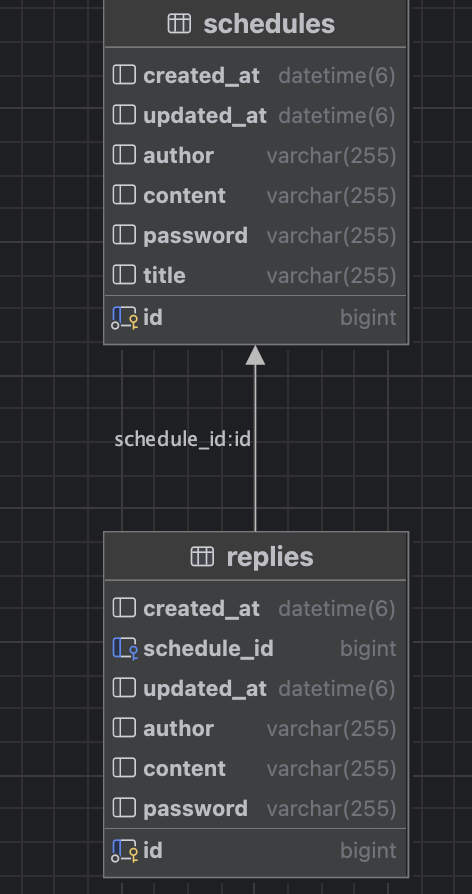

### 실행 결과
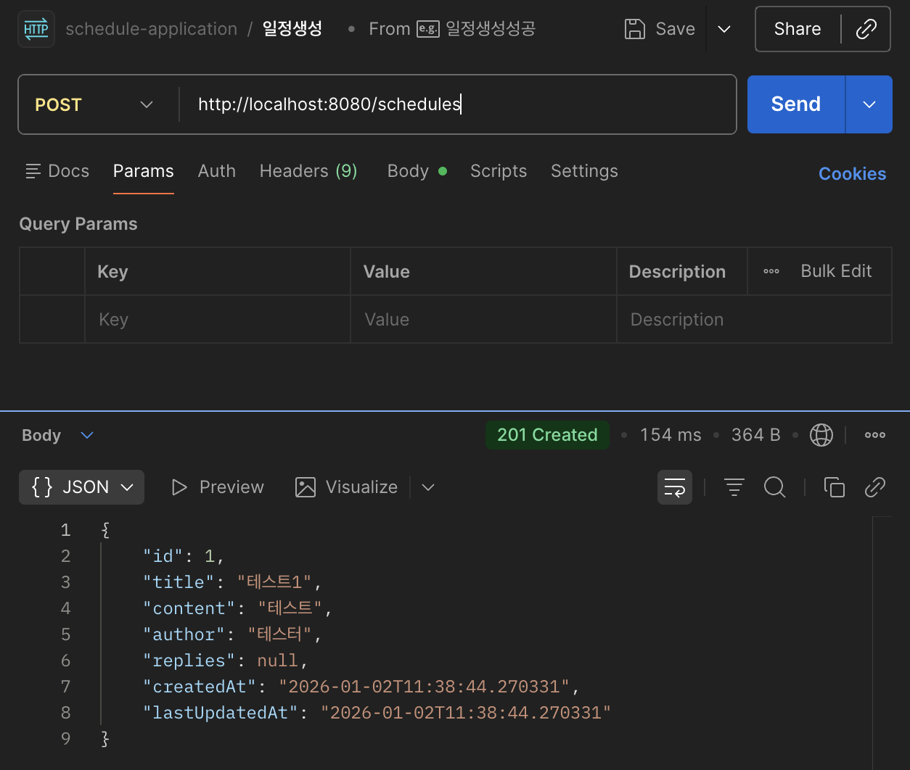
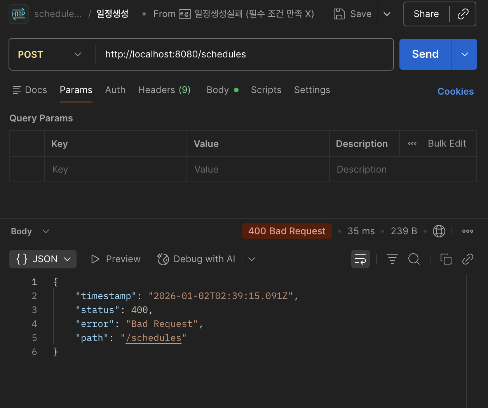
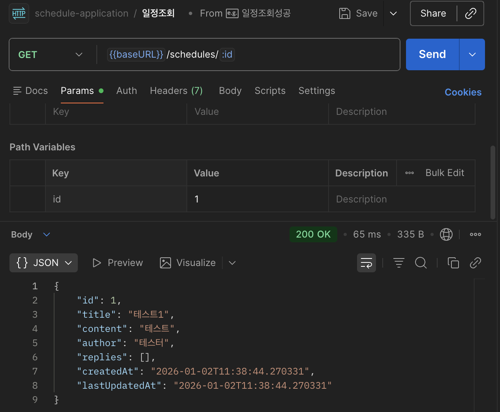
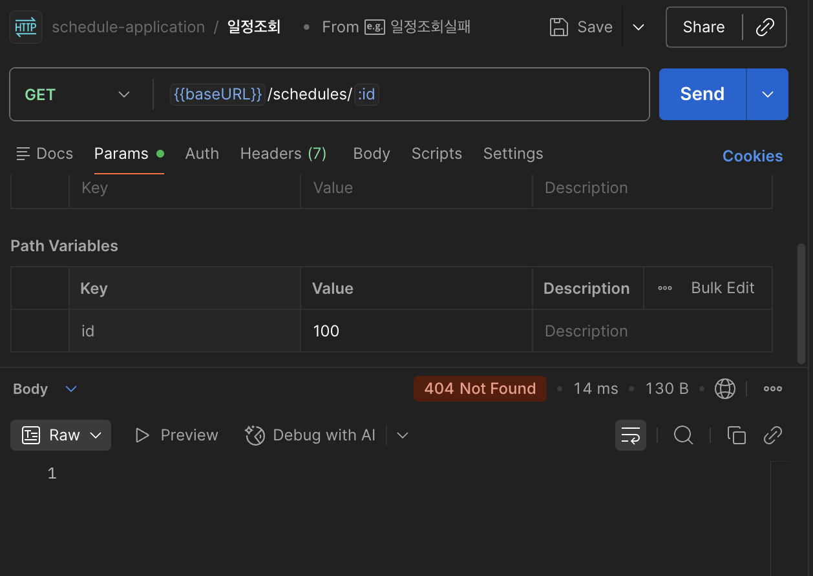

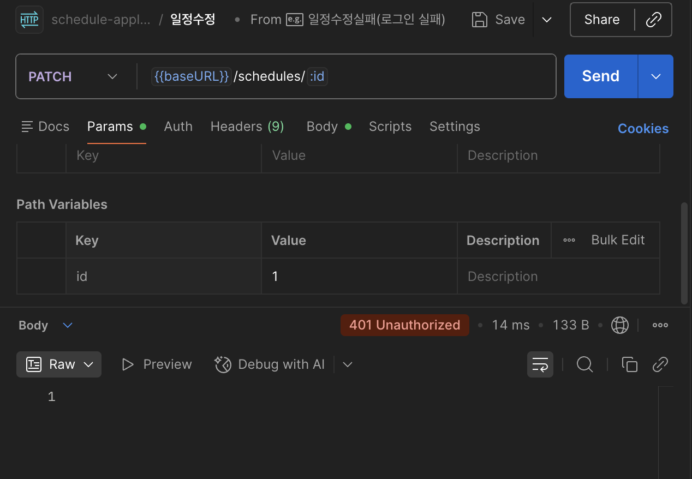
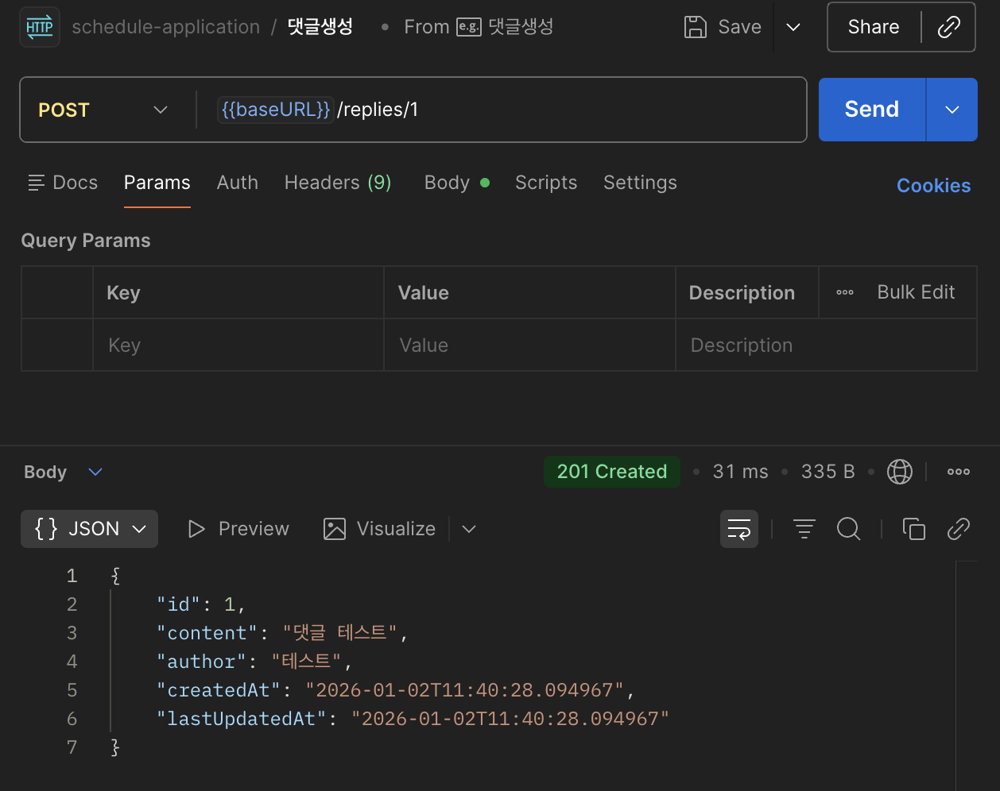
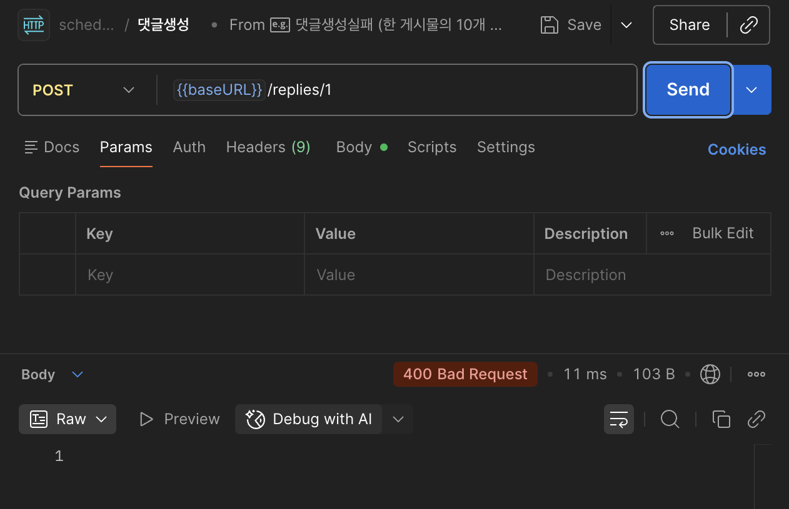
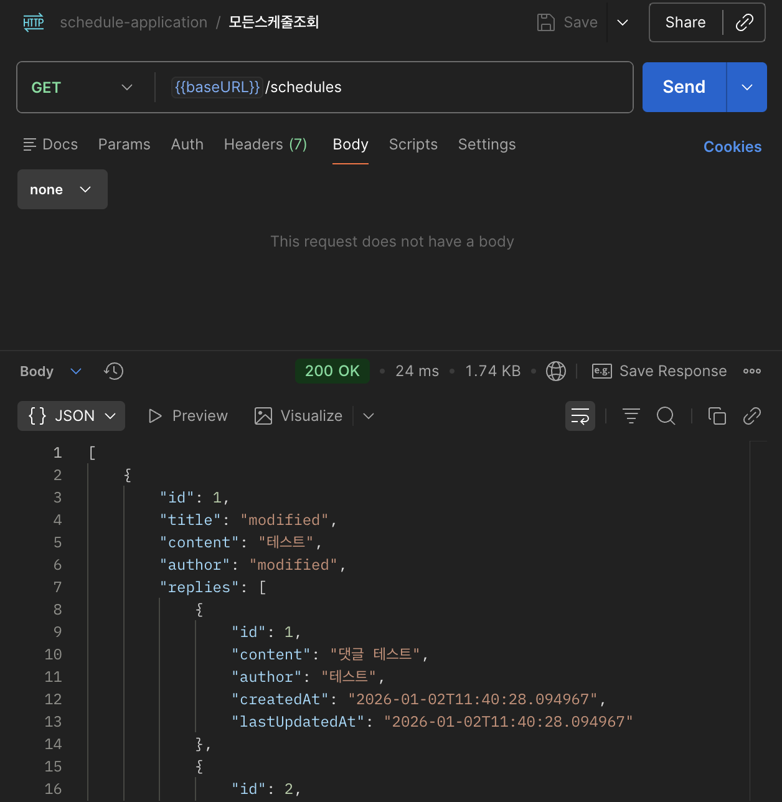
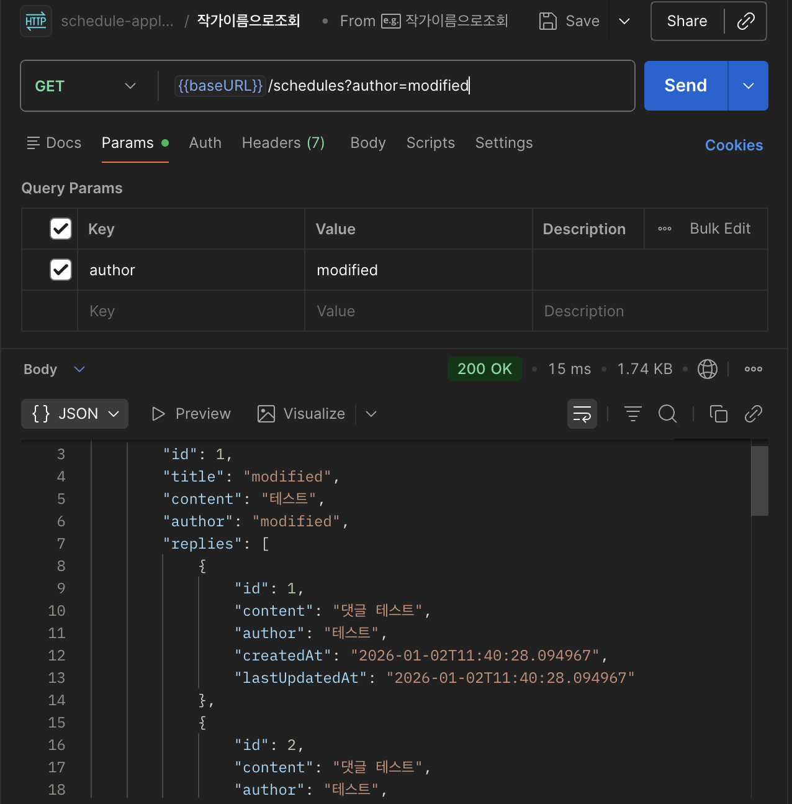
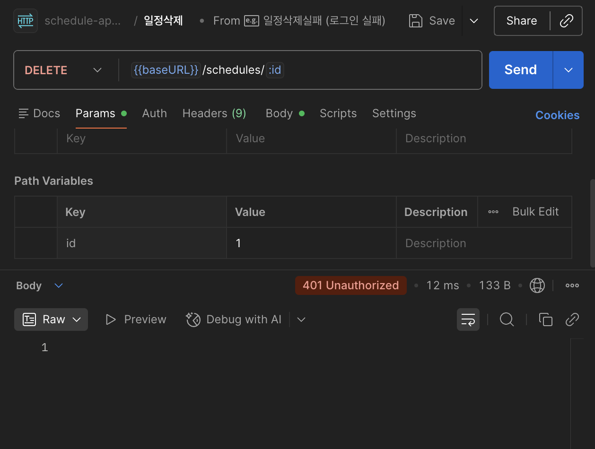
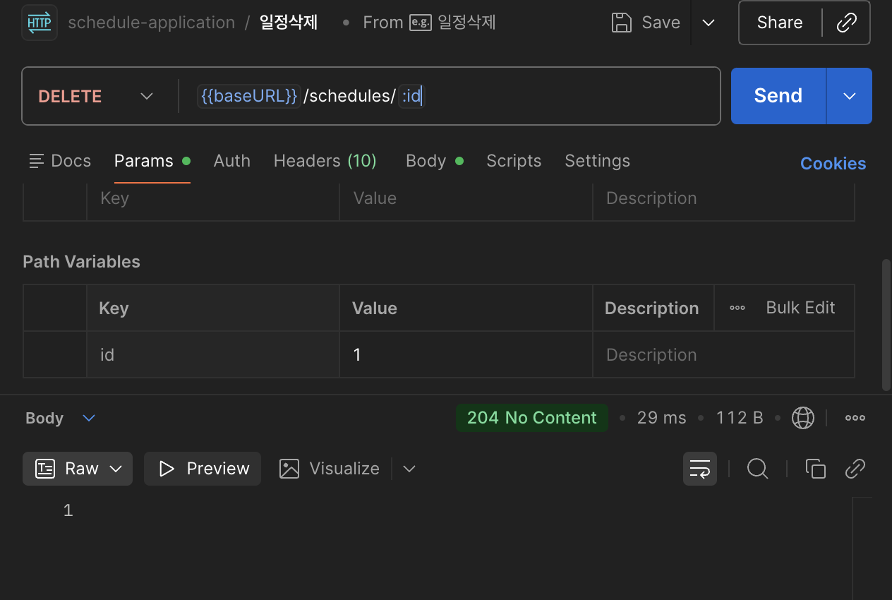

### 구현 사항
- 일정 생성
  - JPA Auditing을 활용하여 작성일, 수정일 필드 자동으로 변경
  - DTO 적용하여 사용자에게 가는 객체나 서비스 계층으로 가는 객체가 유연하도록 함 
- 일정 조회
  - 작성자명을 기준으로 하고  조회를 위해 JPQL 사용
  - DTO 적용하여 사용자에게 가는 객체나 서비스 계층으로 가는 객체가 유연하도록 함
  - GET 매핑 사용
- 선택 일정 조회
  - 일정의 고유 식별자를 사용하여 조회
  - GET 매핑 사용
- 일정 수정
  - 사용자가 일부 정보만 줘도 전체 데이터가 수정되는 것을 막기위해 PATCH 매핑 사용
- 일정 삭제
  - DELETE 매핑 사용
- 댓글 생성
  - 일정과 댓글은 1:N관계이므로 JPA를 사용하여 해당 관계로 매핑
    - FK는 N쪽에 놔야하므로 댓글에서 FK를 관리
  - 하나의 일정에는 댓글을 10개까지만 작성해야 하므로 댓글 repo에서 FK를 기준으로 몇개의 댓글이 있는지 카운트 함수 구현
- 사용자가 일정 조회시 해당 일정에 등록된 댓글들 모두 보이도록 구현
  - 스트림 API를 사용하여 어떤 일정에 포함되는 댓글들을 List<댓글ResponseDTO> 형식으로 변환.
  - 변환된 댓글ResponseDTO를 포함하는 일정ResponseDTO를 반환하도록 구현
- 유저의 입력에 대한 검증 수행
  - 입력 검증을 용이하게 하기 위해 BeanValidation을 사용